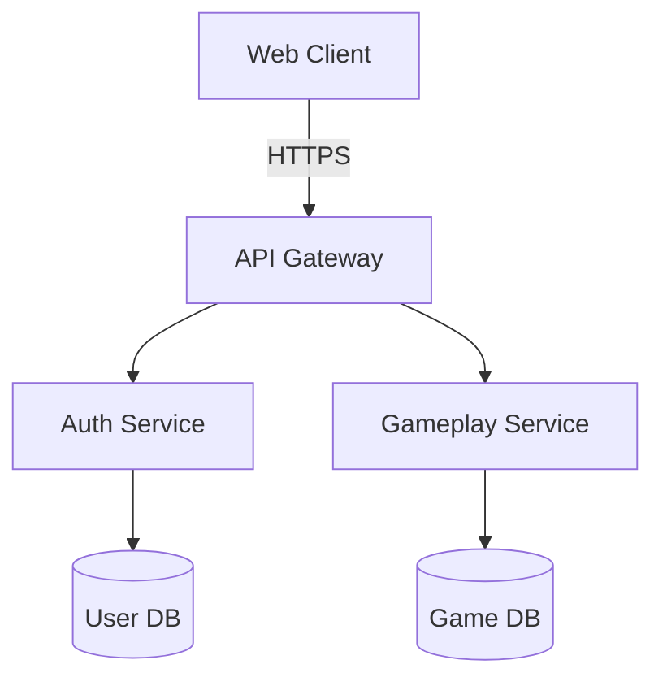

# gamedin-ecosystem

The **gamedin-ecosystem** module powers the user-facing microservices and front-end applications. Its architecture encourages modularity and scalability.

Each service is isolated for security and can be deployed independently to align with battle angel protocol ambitions.
