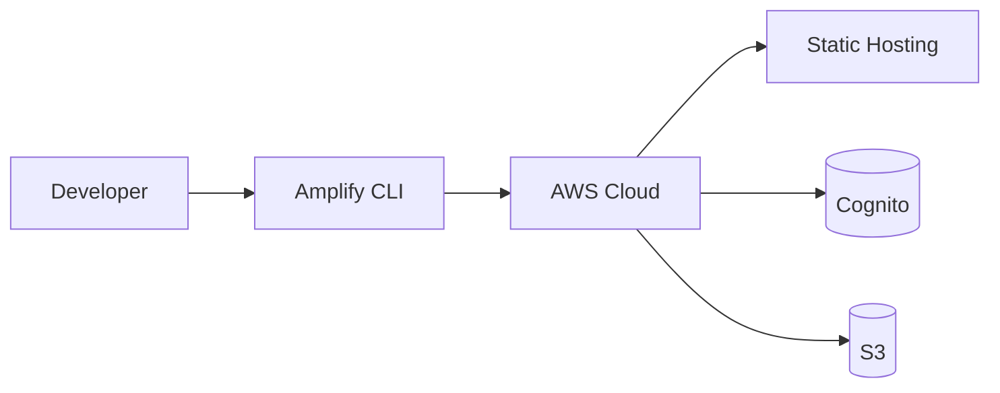

# gamedin-genesis

The **gamedin-genesis** package bootstraps cloud resources via AWS Amplify, orchestrating the foundational layer for the GameDin network.

Infrastructure components are provisioned through infrastructure-as-code, enabling rapid iteration with ritualistic precision.
